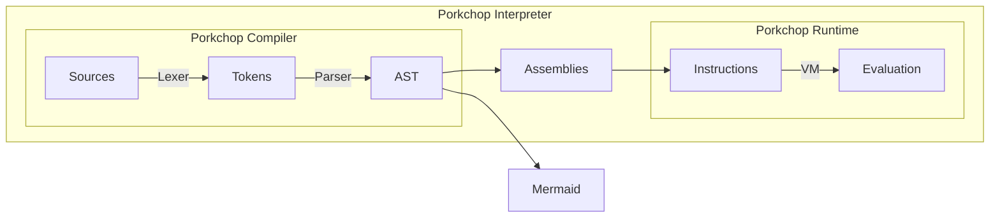
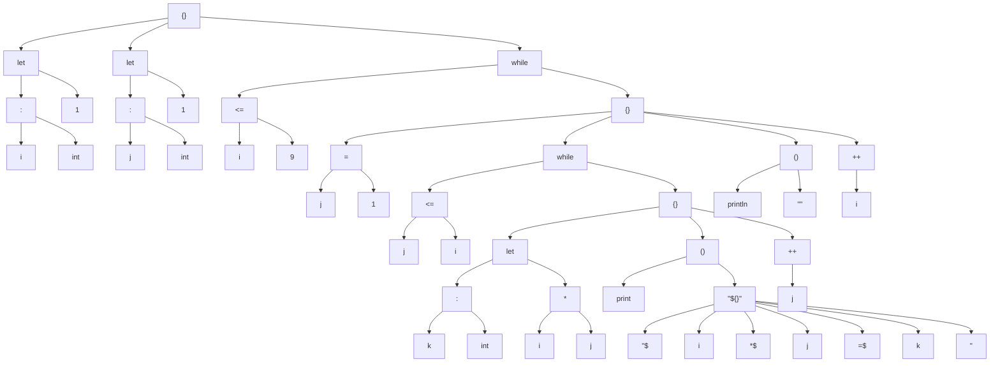
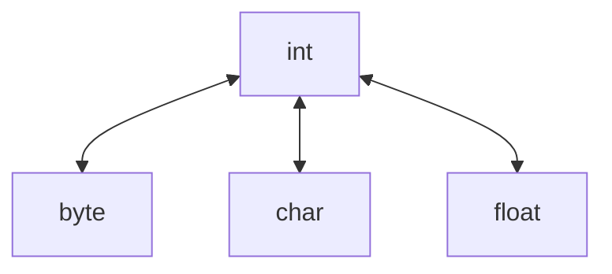

# Porkchop

Porkchop Programming Language: A Complete Nonsense

```
{
    println("hello world")
}
```

:tada: My first one-year-long and 10k-line-code project!

## 组件

Porkchop 有编译器、运行时、解释器、Shell 四个组件。其中前三者的关系及其内容如下图所示。



## 编译器使用

```
Porkchop <input> [options...]
```

第一个参数为输入的源代码文件。

参数：

- `-o <output>` 指定输出文件名。如果缺省，则根据输入文件名和输出类型自动合成。`-o <stdout>` 表示输出到控制台，`-o <null>` 表示只检查语法，不输出。
- `-m` 或 `--mermaid` 输出语法树。
- `-t` 或 `--text-asm` 输出文本汇编。
- `-b` 或 `--bin-asm` 输出二进制汇编。

### Mermaid 的使用

语法树是使用 mermaid 格式输出的。如果你有 Typora，可以新建一个 markdown 文件，并把生成的内容放置于下面的代码里：

````
```mermaid
graph
< 将输出的文本放在这里 >
```
````

如果没有，也可以去 mermaid 的 [在线编辑器](mermaid.live)，在代码栏输入：

```
graph
< 将输出的文本放在这里 >
```

## 运行时使用

```
PorkchopRuntime <input-type> <input-file> [args...]
```

第一个参数为输入的类型。

- `-t` 或 `--text-asm` 输入文本汇编。
- `-b` 或 `--bin-asm` 输入二进制汇编。

第二个参数为输入的汇编文件。该文件应保证对应的由 `Porkchop -t` 或 `Porkchop -b` 输出。

之后的参数作为程序的参数，可以通过 `getargs()` 获取。

## 解释器使用

```
PorkchopInterpreter <input> [args...]
```

编译第一个参数输入的程序之后，立即执行。之后的参数作为程序的参数。

## Shell 使用

你可以直接双击打开！也可以使用命令行传入程序的参数。

```
PorkchopShell [args...]
```

可以对表达式求值，还有一些简单的指令可供使用

```
>>> let a = 5
5
>>> a + 6
11
>>> /lets
let a : int = 5
>>>
```

## 示例代码片段

### 示例：九九乘法表

```
{
    let i = 1
    let j = 1
    while i <= 9 {
        j = 1
        while j <= i {
            let k = i * j
            print("$i*$j=$k ")
            ++j
        }
        println("")
        ++i
    }
}
```

语法树编译结果：



文本汇编编译结果：

```
string 0 
string 1 2A
string 1 3D
string 1 20
func $:v
func $s:v
func $s:v
func $:s
func $s:i
func $s:f
func $i:n
func $:i
func $:i
func $:[s
func $s:v
func $s:v
func $:v
func $:z
func $a:s
func $:v
func $s:[b
func $s:[c
func $[b:s
func $[c:s
(
local i
local i
local i
const 1
store 0
pop
const 1
store 1
pop
L0: nop
load 0
const 9
icmp
le
jmp0 L1
const 1
store 1
pop
L2: nop
load 1
load 0
icmp
le
jmp0 L3
load 0
load 1
imul
store 2
pop
fconst 1
sconst 0
load 0
i2s
sconst 1
load 1
i2s
sconst 2
load 2
i2s
sconst 3
sjoin 7
bind 1
call
pop
inc 1
load 1
pop
jmp L2
L3: nop
const 0
pop
fconst 2
sconst 0
bind 1
call
pop
inc 0
load 0
pop
jmp L0
L1: nop
const 0
return
)
```

程序运行结果：

```
1*1=1
2*1=2 2*2=4
3*1=3 3*2=6 3*3=9
4*1=4 4*2=8 4*3=12 4*4=16
5*1=5 5*2=10 5*3=15 5*4=20 5*5=25
6*1=6 6*2=12 6*3=18 6*4=24 6*5=30 6*6=36
7*1=7 7*2=14 7*3=21 7*4=28 7*5=35 7*6=42 7*7=49
8*1=8 8*2=16 8*3=24 8*4=32 8*5=40 8*6=48 8*7=56 8*8=64
9*1=9 9*2=18 9*3=27 9*4=36 9*5=45 9*6=54 9*7=63 9*8=72 9*9=81
```

### 示例：素数判断

```
{
    fn isPrime(n: int) = {
        if n < 2 { false } else {
            let i = 2
            while i * i <= n {
                if n % i == 0 {
                    return false
                }
                ++i
            }
            true
        }
    }

    let i = 0
    while i < 100 {
        println("isPrime($i)=${isPrime(i)}")
        ++i
    }
}
```

### 示例：八皇后

```
{
    fn output(a: [int]): none = {
        let i = 1
        while i <= 8 {
            let j = 1
            while j <= 8 {
                print(if a[i] == j {"x"} else {"-"})
                ++j
            }
            println("")
            ++i
        }
        println("")
    }
    fn ok(a: [int], x: int, y: int) = {
        let i = 1
        while i <= x - 1 {
            if a[i] == y || a[i] - i == y - x || a[i] + i == y + x {
                return false
            }
            ++i
        }
        return true
    }
    fn queen(a: [int], x: int, c: [int]): none = {
        if x > 8 {
            output(a)
            ++c[0]
            return {}
        }
        let y = 1
        while y <= 8 {
            if ok(a, x, y) {
                a[x] = y
                queen(a, x + 1, c);
                a[x] = 0
            }
            ++y
        }
    }
    let c = [0]

    queen([0, 0, 0, 0, 0, 0, 0, 0, 0, 0], 1, c)
    println("solutions: " + c[0])
}
```

# Porkchop 语法介绍

### 注释

在 Porkchop 中，注释由 # 引导，之后的文本都会被忽略。

### 万物皆为表达式

在 Porkchop 中，万物皆为表达式。一个合法的 Porkchop 源文件有且只有一个表达式。

```
# 非法：没有表达式
```

```
println("hello")
println("world") # 非法：多于一个表达式
```

用花括号括起来的多个表达式算作一个复合表达式。这个复合表达式的值，就是其中最后一个表达式的值。

```
{
    2 * 3
    2 + 3
} # 这个表达式的值为 5
```

在花括号中，分割表达式时，分号不是必须的，换行就行。如果你希望书写多行的表达式，可以利用在行末添加一个反斜杠 `\`，来取消换行符：

```
{
    2\
    +\
    3
} # 这个表达式的值为 5
```

也可以利用圆括号、方括号配对时忽略中间换行符的特性：

```
{
    (2
    +
    3)
} # 这个表达式的值为 5
```

### Unicode 支持

Porkchop 的源文件必须是一个 UTF-8 文件。Porkchop 的标识符和字符串都支持 Unicode。

错误报告在对齐的等宽字体下可以看到更好的效果。但为了实现对齐，Porkchop 仅接受空格作为空白字符，请勿使用制表符 `\t`。

Porkchop 在从文件中读取源代码的时候，使用了 C 语言的标准库，这就意味着无论是哪种换行符（CR `\r`、LF `\n`、CR LF `\r\n`）最终都会被转换为 LF。因此如果你需要显式调用 Porkchop 编译器（例如将 Porkchop 作为一个库使用，或在解释器、Shell 中使用 `eval` 函数），而换行符却不是 LF 的话，编译就会失败。

## 类型和变量

let 关键字引导变量声明，并进行初始化：

```
{
    let a: int = 0 # int 类型的变量 a，初始化为 0
    let b = 0.0    # 省略类型，b 自动推导为 float
    # let 也是表达式，返回 b 的值
} # 所以这个表达式的值为 0.0
```

Porkchop 有这些基本类型：
```
any    # 类型被擦除类型
none   # 表示没有值的类型
never  # 不会返回的类型，如 exit(0) 的类型即为 never
bool   # true 和 false 的类型是 bool
byte   # 无符号单字节整数，无字面量
int    # 八字节有符号整数，如 0
float  # 八字节双精度浮点数，如 0.0
char   # Unicode 字符，如 '你'
string # UTF-8 字符串，如 "你好"
```

整数支持二（0b）、八（0o）、十、十六（0x）进制，浮点数支持十、十六（0x）进制。整数和浮点数的字面量中可以插入下划线，来作为数字分隔符：

```
{
    1234_5678 # ok
    1_23_456  # ok
    1_23.456  # ok
    123_ # error: 非法的数字
    _123 # error: 找不到标识符
}
```

浮点数支持科学计数法，此外还有 `inf` 和 `nan` 两个关键字作为字面量。

类型检查是非常严格的，例如：

```
{
    let apple = 10
    let banana = 10.0
    apple + banana * 2.0
}
```

将会导致编译错误：

```
error: type mismatch on both operands
   4  | apple + banana * 2.0
      | ^~~~~~~~~~~~~~~~~~~~
note: type of left operand is 'int'
   4  | apple + banana * 2.0
      | ^~~~~
note: type of right operand is 'float'
   4  | apple + banana * 2.0
      |         ^~~~~~~~~~~~
```

唯一的例外是，任何类型的值都可以无条件隐式转换为 `none`，也就是忽略表达式的值。`none` 存在一个隐变量 `_`，处处可供存取。

```
{
    _ = 1 # discard this one
    
    _ # obtain a none via load
    () # obtain a none via const
    {} # obtain a none via const
}
```

可以用 as 运算符强制类型转换

```
{
    let a = 10
    let b = 10.0
    let c: int = a + b as int
    let d: float = a as float + b
}
```

`as` 可以进行的类型转换如下图所示：



是的，尽管这三个类型都可以与 `int` 之间进行转换，但是不可以绕过 `int` 直接互相转换。

任何类型都可以用 `as` 转换到自身、`none` 和 `any`，故省略不表。

此外，编译时 `any` 可以转换到任何类型，在运行时才会进行类型检查。

```
{
    let a: int = 0
    let b: any = a as any
    let c: int = b          # compilation error
    let d: int = b as int   # ok 
    let e: int = b as float # runtime error
}
```

复合类型有元组、列表、集合、字典、迭代器、函数（详见后文），前四个可用下面的方法构造：

```
{
    let t: (int, string)    = (12, "apple")
    let l: [int]            = [1, 2, 3]
    let s: @[int]           = @[1, 2, 3]
    let d: @[string: float] = @["pi": 3.14]
    let i: *int             = &s
}
```

如果需要空的列表或字典，需要指明类型。

```
{
    let a        = []          # error
    let b        = [] as [int] # ok
    let c: [int] = []          # ok
}
```

还可以使用一些类型操作来获取简单的静态信息

```
{
    let a = 10                  # a is int
    let b: typeof(a) = a        # b is int
    let c: typeof(a as any) = a # c is any, even if a is actually int during runtime
    let d: elementof([int]) = a # d is int
}
```

这些静态类型操作不会生成出语法树或字节码，它们会立即获取对应的类型，而不会保存获取类型所用的表达式。

支持这些静态类型操作：

获得表达式的类型
```
typeof(expression)
```
获得容器元素的类型
```
elementof([E]) = E
elementof(@[E]) = E
elementof(@[K: V]) = (K, V)
elementof(*E) = E
```
获取元组第 `i` 个元素的类型
```
elementof((E1, E2, ... Ei ...), i) = Ei
```
获取函数参数列表和返回值类型
```
parametersof((P1, P2, ...): R) = (P1, P2, ...)
returnof((P1, P2, ...): R) = R
```

## 运算符

下表包含了 Porkchop 所有的运算符。其中初等表达式也在列，方便观察。

| 优先级 | 结合性 | 运算符     | 运算符                                                       |
| ------ | ------ | ---------- | ------------------------------------------------------------ |
| 0      | -      | 初等表达式 | 布尔、字符、字符串、整数、浮点数字面量<br>元组、列表、集合、字典字面量<br>字符串插值、多行字符串<br>圆括号、花括号、标识符、lambda 表达式<br> `while` `for` `if` `fn` `let` |
| 1      | LR     | 后缀       | 函数调用、两种函数绑定、`as` `is`<br>下标访问、后缀自增自减  |
| 2      | RL     | 前缀       | 正负号、按位取反、逻辑取反<br/>前缀自增自减、求哈希、`sizeof`<br>取迭代器、迭代器步进、迭代器取值 |
| 3      | LR     | 乘除余in   | 乘法、除法、求余、`in`                                       |
| 4      | LR     | 加减       | 加法、减法、字符串连接                                       |
| 5      | LR     | 位移       | 左移、算术右移、逻辑右移                                     |
| 6      | LR     | 大小比较   | 小于、大于、小于等于、大于等于                               |
| 7      | LR     | 等于比较   | 等于、不等于、全等于、不全等于                               |
| 8      | LR     | 按位与     | 按位与                                                       |
| 9      | LR     | 按位异或   | 按位异或                                                     |
| 10     | LR     | 按位或     | 按位或                                                       |
| 11     | LR     | 逻辑与     | 逻辑与                                                       |
| 12     | LR     | 逻辑或     | 逻辑或                                                       |
| 13     | RL     | 赋值       | 赋值、复合赋值、容器增删元素<br>`return` `yield return` `break` `yield break` |

容器、函数、协程相关的运算符详见后面的内容

### 算术运算

算术类型包括 `int` 和 `float`，它们可以参与算术运算，包含加减乘除余。

整数除法和求余时，除数不可以为 0。

加号还可以用来连接字符串。若加号两侧任意一个操作数是字符串，则另一侧的操作数也会隐式被转换为字符串与之连接。

自增自减运算符仅可用于 `int`。

### 位运算

位运算类型包括 `int` 和 `byte`，它们可以参与位运算，包括左移、算术右移、逻辑右移、按位与、按位异或、按位或、按位取反。

进行位移运算时，右操作数若为负数，结果是未定义的。

对于 `byte` 来说，算术右移和逻辑右移等价。`int` 则分别高位补符号位和 0。

### 逻辑运算

逻辑与和逻辑或采用短路求值。

### 比较运算

浮点数比较参见 IEEE 754，比较字符串时采用字典序。

对于值类型来说，全等于 `===`、不全等于 `!==` 与等于、不等于等价，对于对象类型来说，将会直接比较它们的地址。

## 流程控制

只有一个子句的 if 表达式返回 none

```
{
    let a = 0 as any # 丢弃类型信息
    if a is int {
        let a = a as int # 内层的 a 隐藏外层的 a
        println("a+1=${a+1}")
    } # none
}
```

有两个子句的 if 相当于三目表达式

```
{
    let a = 1
    let b = 2
    let m = if a > b { a } else { b }
}
```

else 后面直接 if 可以不用花括号，构成 else if

while 和 for 表达式，默认返回值为 none

```
{
    let i = 1
    let s = 0
    while i < 10 {
        s += i
        i += 1
    } # none
    
    for g in ["hello", "my", "friends"] {
        println(g)
    } # none
}
```

可以使用 break 来跳出循环。无限循环如果不跳出则循环返回值视为 never

```
{
    while true {
        break
    } # none
    
    while true {
    
    } # never
}
```

## 容器

容器包含了列表、集合、字典，你还可以获取容器的迭代器。

`sizeof` 运算符会返回容器的元素个数，此外它还可以获取字符串的长度。但是请注意字符串本身不是容器。

```
{
    println("${sizeof "hello"}") # 5
}
```

### 列表

列表内部一般使用 `std::vector` 实现。

| 运算符    | 含义                        | 复杂度   |
| --------- | --------------------------- | -------- |
| `+=`      | 向列表末尾添加该元素        | 均摊常数 |
| `-=`      | 删除第一个与之相等的元素    | O(n)     |
| `in`      | 检查元素是否在列表中        | O(n)     |
| `==`/`!=` | 判断两个列表是否相等/不相等 | O(n)     |
| `[]`      | 根据下标访问元素            | O(1)     |
| `sizeof`  | 返回列表长度                | O(1)     |

```
{
    let a = [0, 1, 2]
    a += 1
    println("$a") # [0, 1, 2, 1]
    a -= 1
    println("$a") # [0, 2, 1]
    println("${2 in a}")         # true
    println("${a == [0, 2, 1]}") # true
    println("${sizeof a}")       # 3
    a[1] = 5
    println("${a[1]}")           # 5
}
```

### 无须容器与哈希值

集合和字典都是无序容器，会用到元素的哈希值。可以用 `@@` 运算符获取对象的哈希值。

```
{
    println("${@@"hello"}")
}
```

输出 2762169579135187400。

### 集合

集合内部一般使用 `std::unordered_set` 实现。

| 运算符    | 含义                        | 平均复杂度     | 最差复杂度  |
| --------- | --------------------------- | ------------ | ------------ |
| `+=`      | 向集合中添加该元素        | O(1) | O(n) |
| `-=`      | 删除与之相等的元素    | O(1)         | O(n)     |
| `in`      | 检查元素是否在集合中        | O(1)         | O(n)  |
| `==`/`!=` | 判断两个集合是否相等/不相等 | O(n)         | O(n^2)   |
| `sizeof`  | 返回集合元素个数       | O(1)         | O(1)     |


```
{
    let a = @[0, 1, 2]
    a += 1
    println("$a") # @[2, 1, 0]
    a -= 1
    println("$a") # @[2, 0]
    println("${2 in a}")       # true
    println("${a == @[0, 2]}") # true
    println("${sizeof a}")     # 2
}
```

### 字典

字典内部一般使用 `std::unordered_map` 实现。

| 运算符    | 含义                        | 平均复杂度     | 最差复杂度  |
| --------- | --------------------------- | ------------ | ------------ |
| `+=`      | 向字典中添加该元素      | O(1) | O(n) |
| `-=`      | 删除键与之相等的元素 | O(1)         | O(n)     |
| `in`      | 检查键是否在集合中        | O(1)         | O(n)  |
| `==`/`!=` | 判断两个字典是否相等/不相等 | O(n)         | O(n^2)   |
| `[]` | 访问/修改/添加元素 | O(1) | O(n) |
| `sizeof`  | 返回字典元素个数     | O(1)         | O(1)     |


```
{
    let a = @[0: 'a', 1: 'b', 2: 'c']
    a += (0, 'd')
    println("$a") # @[2: c, 1: b, 0: d]
    a -= 1
    println("$a") # @[2: c, 0: d]
    println("${2 in a}")                 # true
    println("${a == @[0: 'd', 2: 'c']}") # true
    println("${sizeof a}")               # 2
}
```

其中 `[]` 的功能较多，当元素存在时，可以起到访问和修改的作用；当元素不存在时，可以用于插入新的元素。

```
{
    let a = @[0: 'a']
    a[0] = 'b'
    println("${a[0]}") # b
    a[1] = 'c'
    println("$a")      # @[1: c, 0: b]
}
```

### 迭代器

以上所有的容器皆可通过 `&` 运算符来获取迭代器。在使用迭代器遍历容器的时候修改容器，结果是未定义的。

`>>` 前缀运算符，用于迭代器的步进，并返回 `bool` 指示是否还有元素。如果为真，则可以通过 `*` 前缀运算符来访问这个元素。


```
{
    let a = [1, 2, 3]
    let it = &a
    while >>it {
        println("${*it}")
    }
    for e in a {
        println("$e")
    }
    for e in &a {
        println("$e")
    }
}
```

三次循环的含义是相同的，也就是说，迭代器（iterator）本身也是可迭代（iterable）的。

## 函数

fn 关键字引导，参数如下所示，返回值可以指定也可以推导，参数类型必须指定。

```
{
    fn square(x: int) = {
        x * x
    }
}
```

函数也可以作为参数传递

```
{
    fn caller(callback: (string): none) = {
        callback("hello")
    }
    caller(println)
}
```

可以用 return 提前返回，也可以直接利用表达式求得。

提供了两种绑定机制：

第一种提供了类似成员函数的语法，实际上是调用对象作为第一个参数的函数。为了美观起见，该运算符右侧必须是标识符。

```
{
    # 下面两种形式等价：
    println("hello")
    "hello".println()

    fn f(a: int, b: int, c: int) = {}

    let f1 = 1.f
    let f2 = 2.f1
    let f3 = 3.f2

    f3() # 等价于 f(1, 2, 3)
    
    3.(2.(1.f))() # 非法
}
```

第二种直接提供了科里化的支持。

```
{
    fn f(a: int, b: int, c: int) = {}

    let f1 = f$(1, 2)
    f1(3) # 等价于 f(1, 2, 3)
    
    # 以下表达式全部等价：
    
    f(1, 2, 3)
    f$(1)(2, 3)
    f$(1, 2)(3)
    f$(1, 2, 3)()
    f$(1)$(2)$(3)()
}
```

可以提前声明函数，以便实现函数的交叉调用。声明函数时返回值类型必须被指定：

```
{
    fn f(): none
    fn g() = f()
    fn f() = println("hello")
}
```

函数声明之后必须给出定义，且与声明同作用域：

```
{
    fn f(): none = {
        fn f() = println("hello") # 内层定义域的 f，与外层无关
    }
} # error: 外层定义域没有定义 f
```


函数不可以捕获外部的变量，但是 lambda 表达式可以。

```
{
    fn withdraw(balance: int) = {
        let balance = [balance] # shadowing
        $ balance (amount: int) = {
            if (balance[0] >= amount) {
                balance[0] -= amount
                if (amount >= 0) {
                    println("" + balance[0])
                }
            } else {
                println("v50")
            }
        }
    }
    fn v50(account: (int): none) = account(-50)
    let w1 = withdraw(100)
    let w2 = withdraw(100)
    w1(50)
    w2(50)
    w1(70)
    v50(w1)
    w1(70)
}
```

美元符号和参数列表之间的就是捕获的变量。变量是按值捕获的，且每次函数调用时值都与捕获时相同。

## 协程

Porkchop 支持生成器（generator）协程（coroutine）：

```
{
    fn range(n: int) yield {
        let i = 0
        while i < n {
            yield return i++
        }
    }

    for i in range(10) {
        print("$i")
    }
}
```

输出：

```
0123456789
```

协程必须返回迭代器类型。

协程刚创建时，是挂起状态，当调用迭代器的 `>>` 运算符时，协程就会恢复运行。如果遇到 `yield break` 或者函数函数末尾，那么 `>>` 就会返回 `false`，表示协程已经结束。如果遇到一个 `yield return` ，那么 `>>` 就会返回 `true`，返回的值就可以通过 `*` 运算符获取，而协程则会再次挂起。

## 外部函数

Porkchop 预定义了下列函数：

```
>>> /fns
fn eval(any, string): any
fn fromChars([char]): string
fn toBytes(string): [byte]
fn toChars(string): [char]
fn typename(any): string
fn gc(): none
fn print(string): none
fn println(string): none
fn nanos(): int
fn readLine(): string
fn parseInt(string): int
fn parseFloat(string): float
fn millis(): int
fn getargs(): [string]
fn exit(int): never
fn input(string): none
fn output(string): none
fn flush(): none
fn fromBytes([byte]): string
fn eof(): bool
```

### I/O 函数

- `print` `println`

输出字符串，后者会额外输出一个换行符并 `flush`

- `flush`

刷新缓冲区

- `readLine`

读入一行字符串，不包含换行符

- `eof`

判断输入文件是否结束

- `input` `output`

重定向输入、输出文件

### 虚拟机状态

- `gc`

手动调用垃圾回收器

- `getargs`

获取程序启动时传入的参数

- `exit`

退出程序

- `eval`

对提供的 Porkchop 表达式求值，第一个参数为任意上下文，在脚本中可以以标识符 `context` 来访问。

仅提供 Interpreter 和 Shell 的支持，Runtime 无法调用。

```
>>> let context = "hello" as any
hello
>>> eval(context, "context + \" world\"")
hello world
```

- `typename`

获取 `any` 对象的类型名称，与在代码中书写的格式一致。

### 实用工具

- `parseInt` `parseFloat`

解析 `int` 和 `float`。注意这个解析仅支持最简单的表达，并非 Porkchop 的数字解析。

- `millis` `nanos`

毫秒、纳秒计时器，请使用两个次调用的差值来计时。

- `fromChars` `toChars` `fromBytes` `toBytes`

字符串 `string` 与字符数组 `[char]` 和字节数组 `[byte]` 的转换


## 语法糖专题

### 解构

元组可以被解构：
```
{
    let (a, b) = (1, 2)
    a + b # 3
}
```

你可以用 `_` 标注想要忽略的元素或者是参数

```
{
    let (a, _) = (1, 2) # 忽略第二个元素
    let f = $(_) = 0 # 忽略第一个参数
}
```

解构在迭代字典的时候非常有用：

```
{
    for (key, value) in @["hello": "world"] {
        println("key=$key, value=$value")
    }
}
```

经典的不借助第三个变量交换两个数：

```
{
    let a = 5
    let b = 6

    (a, b) = (b, a)

    println("a = $a")
    println("b = $b")
}
```

解构是支持递归的：

```
{
    let ((a, b), c) = ((1, 2), 3)
}
```

### 字符串插值

在字符串中，可以使用美元符号加标识符来插入变量的值

```
{
    let i = 2
    println("i=$i") # 输出 i=2
}
```

如果需要书写表达式，则需要在美元符号后使用花括号

```
{
    let i = 3
    println("i+2=${i+2}") # 输出 i+2=5
}
```

这样的插值是任意嵌套的、重复、混搭的

```
{
    let he = "he" # special salute to helang
    "${he}llo ${
        "${'w'}or" + "ld"
    }"
} # "hello world"
```

在上面的例子中，如果 `"${he}"` 去掉花括号，则会被解析为 `"$hello"`，因此不可省略。

### 多行字符串

多行字符串由 `"""` 引导，至 `"""` 结束。如下所示

```
{
    println("""
multiline
rocks
""")
}
```

输出：

```

multiline
rocks

```

多行字符串不会对文本进行转义，一切按原文进行解读


```
{
    println("""\n\"\\""""")
}
```

输出：

```
\n\"\\""
```


多行字符串里仍然可以引入插值，如果你需要一些需要转义的字符也可以利用这一点

```
{
    println("""${'$'}${'\n'}""${'"'}hello"""""")
}
```

输出：

```
$
"""hello"""
```

如果第二行的三个连续的双引号不以这种方式写出的话，就会被判定为多行字符串的终止符。

