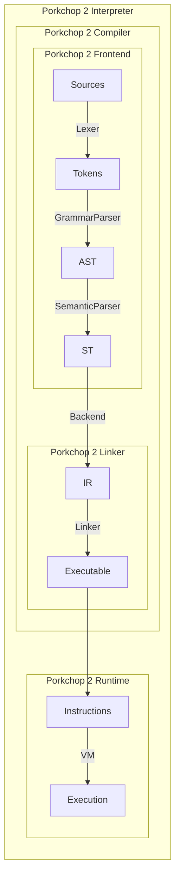

# Porkchop 2

```mermaid
graph LR

subgraph Porkchop 2 Interpreter

subgraph Porkchop 2 Compiler

subgraph Porkchop 2 Frontend
Sources-->|Lexer|Tokens-->|GrammarParser|AST-->|SemanticParser|ST
end
subgraph Porkchop 2 Linker
ST-->|Backend|IR-->|Linker|Executable
end
end
subgraph Porkchop 2 Runtime
Executable-->Instructions-->|VM|Execution
end

end
```