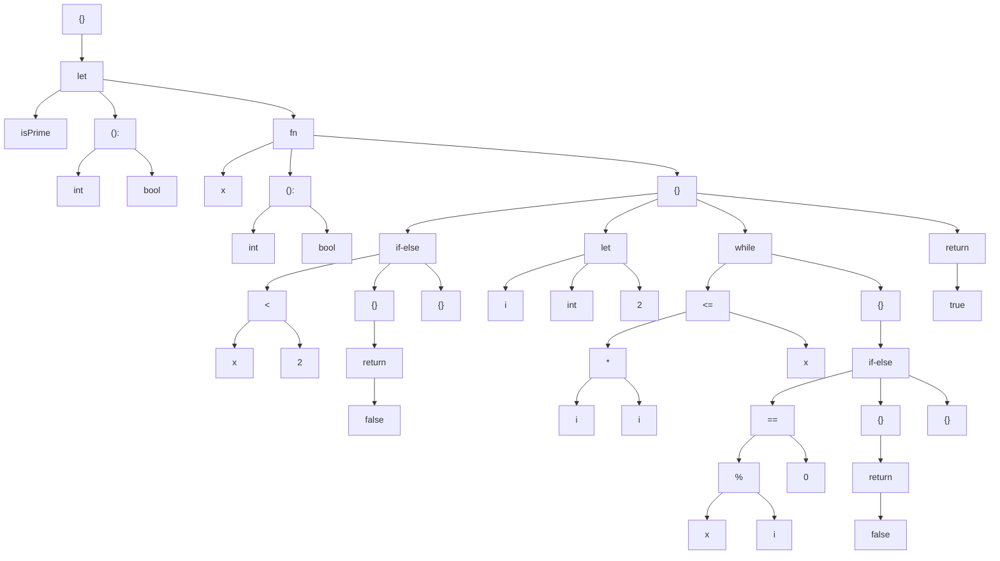

# Porkchop

Porkchop Programming Language

```
{
	println("hello world")
}
```

## 说明

目前编译器只有前端，只能用来检查语法错误、生成语法树。

诚邀加入编译器后端、运行时的开发！

## 编译器使用

```
porkchop source.txt
```

编译当前文件夹下的 source.txt，编译器不要求后缀名，默认在当前文件夹下输出 source.txt.mermaid

```
porkchop source.txt -o hello.mermaid
```

指定输出文件名

```
porkchop source.txt -o <stdout>
```

指定控制台为输出

## 输出文件的使用

如果你有 Typora，可以新建一个 markdown 文件，并把生成的内容放置于下面的代码里：

````
```mermaid
graph
< 将输出的文本放在这里 >
```
````

如果没有，也可以去 mermaid 的 [在线编辑器](mermaid.live)，在代码栏输入：

```
graph
< 将输出的文本放在这里 >
```

## 示例：素数判断

```
{
    let isPrime = fn(x: int): bool = {
        if x < 2 {
            return false
        }
        let i = 2
        while i * i <= x {
            if x % i == 0 {
                return false
            }
        }
        return true
    }
}
```

编译结果：



## 源文件

一个合法的 Porkchop 源文件有且只有一个表达式。

```
println("hello") # 用 # 引导注释
println("world") # 非法：多于一个表达式
```

用花括号括起来的多个表达式算作一个表达式。这个花括号表达式的值，就是最后一个表达式的值。

```
{
	println("hello")
	println("world")
	0
} # 这个表达式的值为 0
```

不需要用分号分割表达式，换行就行。

## 类型和变量

let 关键字引导变量声明，并进行初始化

```
{
	let a: int = 0 # int 类型的变量 a，初始化为 0
	let b = 0.0    # 省略类型，b 自动推导为 float
	# let 也是表达式，返回 b 的值
} # 所以这个表达式的值为 0.0
```

Porkchop 有这些基本类型：
```
none   # {} 的类型是 none，表示没有值
never  # 不会返回的类型，如 exit(0) 的类型即为 never
bool   # true 和 false 的类型是 bool
byte   # 无符号单字节整数，无字面量
int    # 八字节有符号整数，如 0
float  # 八字节双精度浮点数，如 0.0
char   # Unicode 字符，如 '你'
string # UTF-8 字符串，如 "你好"
```

类型之间的转换是非常严格的，这里不作详细介绍了：

```
{
    let a = 10
    let b = 10.0
    a + b
}
```

编译器输出：

```
Compilation Error: types mismatch on both operands, the one is 'int', but the other is 'float' at line 4 column 5 to 10
    4 |     a + b
      |     ^~~~~
```

可以用 as 运算符强制类型转换

```
{
    let a = 10
    let b = 10.0
    let c = a + b as int    # c is int
    let d = a as float + b  # d is float
}
```

复合类型有元组、列表、字典、函数

```
{
	let t: (int, string)    = (12, "apple")
	let l: [int]            = [1, 2, 3]
	let d: @[string: float] = @["pi": 3.14]
	let f: (int): int       = fn(x: int) = x
}
```

实际上这里的类型可以推导，写出来只是方便观察

如果需要空的列表或字典，可以使用 default 关键字

```
{
	let e = default([int])
}
```

还可以使用一些操作来实现简单的静态反射

```
{
	let a = 10                  # a is int
	let b: typeof(a) = a        # b is int
	let c: typeof(a as any) = a # c is any, even if a is actually int
	let d: elementof([int]) = a # d is int
}
```

这里从略

## 流程控制

只有一个子句的 if 表达式返回 none

```
{
	let a = 0 as any # 丢弃类型信息
	if a is int {
		println("a is int")
	} # none
}
```

有两个子句的 if 相当于三目表达式

```
{
	let a = 1
	let b = 2
	let m = if a > b { a } else { b }
}
```

循环有 while 和 for 表达式，默认返回 none

```
{
	let i = 1
	let s = 0
	while i < 10 {
		s += i
		i += 1
	} # none
	
	for g in ["hello", "my", "friends"] {
		println(g)
	} # none
}
```

但是如果循环里含有 yield 表达式，那么会返回对应类型的列表

```
{
	for x in [1, 2, 3] {
		if x != 2 {
			yield x * 2 + 1
		}
	} # 返回 [3, 7]
	
	# yield 也可以放在括号外面
	for x in [1, 2, 3] yield {
		x * 2 + 1
	} # 返回 [3, 5, 7]
}
```

支持 break 但是不支持 continue，这里从略

try 表达式

```
{
	try {
		throw "whatever"
	} catch e { # e is any
		println(e as string)
	}
}
```

这里从略

## 函数

fn 关键字引导，参数如下所示，返回值可以指定也可以推导，参数类型必须指定。

```
{
	let square = fn(x: int) = {
		x * x
	}
}
```

函数也可以作为参数传递

```
{
	let caller = fn(callback: (string): none) = {
		callback("hello")
	}
	caller(println)
}
```

可以用 return 提前返回，也可以直接利用表达式求得。（例子见前面的 isPrime）

提供了一种绑定机制，成员函数实际上是调用对象作为第一个参数的函数，如下所示：

```
{
	# 下面两种形式等价：
	println("hello")
	"hello".println()
	
	let f = 0 as any as (int, int, int): none

    let f1 = 0.f
    let f2 = 0.f1
    let f3 = 0.f2
	
	f3() # 等价于 f(0, 0, 0)
}
```

将多个函数放置在一个元组里，还支持重载

```
{
	let f1 = fn()=1
	let f2 = fn(x: int)=2
	let f3 = fn(x: string)=3
	let f = (f1, f2, f3)
	f()    #1
	f(0)   #2
	f("0") #3
}
```

更多细节这里从略

## 解构

元组可以被解构：
```
{
	let (a, b) = (1, 2)
	a + b # 3
}
```

你可以用下划线标注想要忽略的元素或者是参数

```
{
	let (a, _) = (1, 2) # 忽略第二个元素
	let f = fn(_) = 0 # 忽略第一个参数
}
```

解构在迭代字典的时候非常有用：

```
{
	for (key, value) in @[] {
		# ...
	}
}
```

