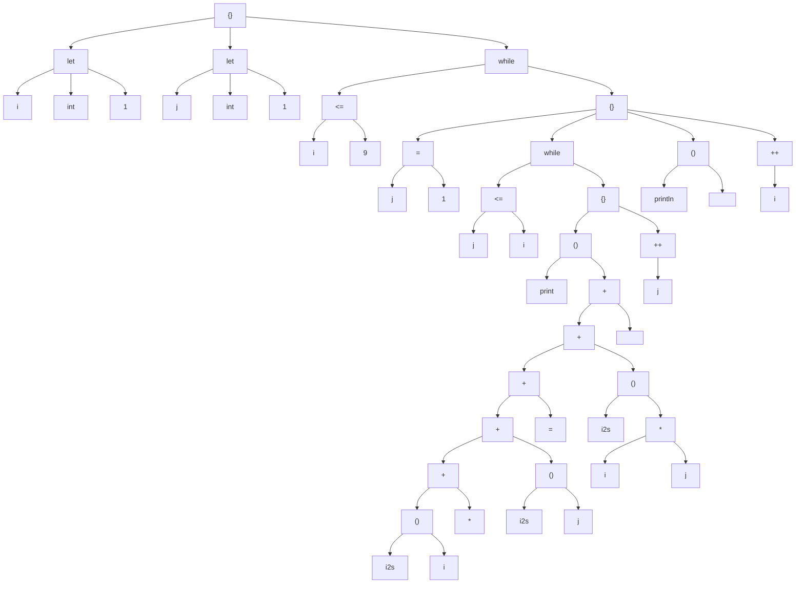

# Porkchop

Porkchop Programming Language

```
{
    println("hello world")
}
```

## 编译器使用

```
Porkchop <input> [options...]
```

第一个参数为输入的源代码文件。

参数：

- `-o <output>` 指定输出文件名。如果缺省，则根据输入文件名和输出类型自动合成。`-o <stdout>` 表示输出到控制台，`-o <null>` 表示只检查语法，不输出。
- `-m` 或 `--mermaid` 输出语法树。
- `-t` 或 `--text-asm` 输出文本汇编。

### Mermaid 的使用

语法树是使用 mermaid 格式输出的。如果你有 Typora，可以新建一个 markdown 文件，并把生成的内容放置于下面的代码里：

````
```mermaid
graph
< 将输出的文本放在这里 >
```
````

如果没有，也可以去 mermaid 的 [在线编辑器](mermaid.live)，在代码栏输入：

```
graph
< 将输出的文本放在这里 >
```

## 运行时使用

```
PorkchopRuntime <input> [args...]
```

第一个参数为输入的文本汇编文件。该文件应该保证由 `Porkchop -t` 输出。

之后的参数作为程序的参数，在程序中可以通过 `getargs()` 获取。

## 解释器使用

```
PorkchopInterpreter <input> [args...]
```

等价于

```
Porkchop <input> -t -o tmp
PorkchopRuntime tmp [args...]
```

## 示例：九九乘法表

```
{
    let i = 1
    let j = 1
    while i <= 9 {
        j = 1
        while j <= i {
            print(i2s(i) + "*" + i2s(j) + "=" + i2s(i * j) + " ")
            ++j
        }
        println("")
        ++i
    }
}
```

语法树编译结果：（字符串字面量节点生成还存在一些问题）



文本汇编编译结果：

```
(
local 2
const 1
store 0
pop
const 1
store 1
pop
L0: nop
load 0
const 9
icmp
le
jmp0 L1
const 1
store 1
pop
L2: nop
load 1
load 0
icmp
le
jmp0 L3
func 1
func 4
load 0
bind 1
call
string 1 2A
sadd
func 4
load 1
bind 1
call
sadd
string 1 3D
sadd
func 4
load 0
load 1
imul
bind 1
call
sadd
string 1 20
sadd
bind 1
call
pop
inc 1
load 1
pop
jmp L2
L3: nop
const 0
pop
func 2
string 0 
bind 1
call
pop
inc 0
load 0
pop
jmp L0
L1: nop
const 0
return
)
```

程序运行结果：

```
1*1=1
2*1=2 2*2=4
3*1=3 3*2=6 3*3=9
4*1=4 4*2=8 4*3=12 4*4=16
5*1=5 5*2=10 5*3=15 5*4=20 5*5=25
6*1=6 6*2=12 6*3=18 6*4=24 6*5=30 6*6=36
7*1=7 7*2=14 7*3=21 7*4=28 7*5=35 7*6=42 7*7=49
8*1=8 8*2=16 8*3=24 8*4=32 8*5=40 8*6=48 8*7=56 8*8=64
9*1=9 9*2=18 9*3=27 9*4=36 9*5=45 9*6=54 9*7=63 9*8=72 9*9=81
```

## 源文件

Porkchop 源文件的注释由 # 引导，之后的文本都会被忽略。

一个合法的 Porkchop 源文件有且只有一个表达式。

```
# 非法：没有表达式
```

```
println("hello")
println("world") # 非法：多于一个表达式
```

用花括号括起来的多个表达式算作一个复合表达式。这个复合表达式的值，就是其中最后一个表达式的值。

```
{
    println("hello")
    println("world")
    2 + 3
} # 这个表达式的值为 5
```

分割表达式时分号不是必须的，换行就行。

## 类型和变量

let 关键字引导变量声明，并进行初始化

```
{
    let a: int = 0 # int 类型的变量 a，初始化为 0
    let b = 0.0    # 省略类型，b 自动推导为 float
    # let 也是表达式，返回 b 的值
} # 所以这个表达式的值为 0.0
```

Porkchop 有这些基本类型：
```
none   # {} 的类型是 none，表示没有值
never  # 不会返回的类型，如 exit(0) 的类型即为 never
bool   # true 和 false 的类型是 bool
byte   # 无符号单字节整数，无字面量
int    # 八字节有符号整数，如 0
float  # 八字节双精度浮点数，如 0.0
char   # Unicode 字符，如 '你'
string # UTF-8 字符串，如 "你好"
```

类型之间的转换是非常严格的，这里不作详细介绍了：

```
{
    let a = 10
    let b = 10.0
    a + b
}
```

编译器输出：

```
Compilation Error: types mismatch on both operands, the one is 'int', but the other is 'float' at line 4 column 5 to 10
    4 |     a + b
      |     ^~~~~
```

可以用 as 运算符强制类型转换

```
{
    let a = 10
    let b = 10.0
    let c = a + b as int    # c is int
    let d = a as float + b  # d is float
}
```

复合类型有元组、列表、集合、字典、函数（详见后文）

```
{
    let t: (int, string)    = (12, "apple")
    let l: [int]            = [1, 2, 3]
    let s: @[int]           = @[1, 2, 3]
    let d: @[string: float] = @["pi": 3.14]
}
```

实际上这里的类型可以推导，写出来只是方便观察

如果需要空的列表或字典，可以使用 default 关键字

```
{
    let e = default([int])
}
```

还可以使用一些类型操作来获取简单的静态信息

```
{
    let a = 10                  # a is int
    let b: typeof(a) = a        # b is int
    let c: typeof(a as any) = a # c is any, even if a is actually int
    let d: elementof([int]) = a # d is int
}
```

这里从略

## 流程控制

只有一个子句的 if 表达式返回 none

```
{
    let a = 0 as any # 丢弃类型信息
    if a is int {
        println("a is int")
    } # none
}
```

有两个子句的 if 相当于三目表达式

```
{
    let a = 1
    let b = 2
    let m = if a > b { a } else { b }
}
```

循环有 while 和 for 表达式，默认返回 none

```
{
    let i = 1
    let s = 0
    while i < 10 {
        s += i
        i += 1
    } # none
    
    for g in ["hello", "my", "friends"] {
        println(g)
    } # none
}
```

可以使用 break 来跳出循环，如果无限循环不跳出则视为 never

```
{
    while true {
        break
    } # none
    
    while true {
    
    } # never
}
```

## 函数

fn 关键字引导，参数如下所示，返回值可以指定也可以推导，参数类型必须指定。

```
{
    fn square(x: int) = {
        x * x
    }
}
```

函数也可以作为参数传递

```
{
    fn caller(callback: (string): none) = {
        callback("hello")
    }
    caller(println)
}
```

可以用 return 提前返回（例子见前面的 isPrime），也可以直接利用表达式求得。

提供了一种绑定机制，成员函数实际上是调用对象作为第一个参数的函数，如下所示：

```
{
    # 下面两种形式等价：
    println("hello")
    "hello".println()

    fn f(a: int, b: int, c: int) = {}

    let f1 = 0.f
    let f2 = 0.f1
    let f3 = 0.f2

    f3() # 等价于 f(0, 0, 0)
}
```

在定义之前使用函数，需要在函数定义同层位置声明：

```
{
    fn f(x: string): none
    f("hello")
    fn f(x: string) = println(x)
}
```

此外还有 lambda 表达式：

```
{
    fn withdraw(balance: int) = {
        let balance = [balance] # shadowing
        $ balance (amount: int) = {
            if (balance[0] >= amount) {
                balance[0] -= amount
                if (amount >= 0) {
                    println(i2s(balance[0]))
                }
            } else {
                println("v50")
            }
        }
    }
    fn v50(account: (int): none) = account(-50)
    let w1 = withdraw(100)
    let w2 = withdraw(100)
    w1(50)
    w2(50)
    w1(70)
    v50(w1)
    w1(70)
}
```

美元符号和参数列表之间的就是捕获的变量。变量是按值捕获的，且每次函数调用时值都与捕获时相同。

## 解构

元组可以被解构：
```
{
    let (a, b) = (1, 2)
    a + b # 3
}
```

你可以用下划线标注想要忽略的元素或者是参数

```
{
    let (a, _) = (1, 2) # 忽略第二个元素
    let f = fn(_) = 0 # 忽略第一个参数
}
```

解构在迭代字典的时候非常有用：

```
{
    for (key, value) in @["hello": "world"] {
        # ...
    }
}
```

## Unicode 支持

Porkchop 的源文件应该是一个 UTF-8 文件。Porkchop 的标识符和字符串都支持 Unicode。

```
{
    let 你好Hello世界: int = "再见Goodbye我的朋友"
}
```

编译器输出：

```
Compilation Error: 'string' is not assignable to 'int' at line 2 column 34 to 61
   2  |     let 你好Hello世界: int = "再见Goodbye我的朋友"
      |                              ^~~~~~~~~~~~~~~~~~~~~
```

在对齐的等宽字体下可以看到更好的效果。
